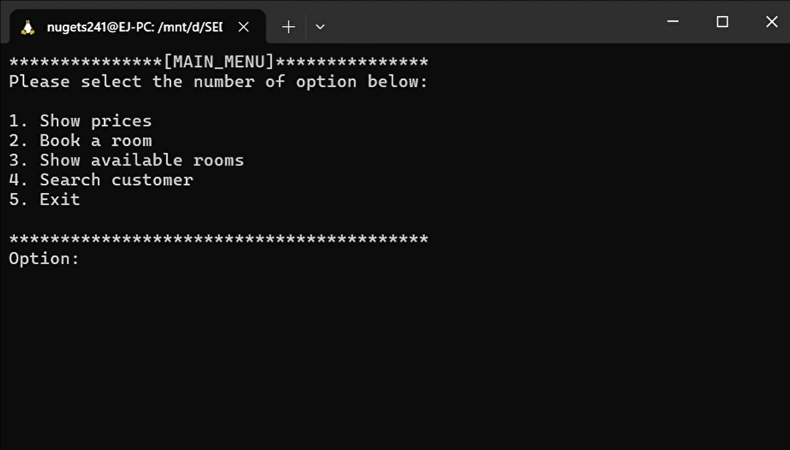

# Hotel Room Booking Program

## Screenshot

## Overview
This program is a simple yet comprehensive hotel room booking system created as a part of the Programming 1 (C++) Final Assignment. Designed for simplicity and ease of use, it is suitable for users with basic computer knowledge.

## Features
- **Show Prices of Room Types**: Allows users to view the prices of different types of rooms available in the hotel.
- **Room Reservation**: Users can book rooms of their choice.
- **Show Available Rooms**: Displays the number of rooms available for each room type.
- **Search Customer**: Enables searching for customers by reservation number or name.
- **Input Validation**: Prevents invalid inputs from crashing the program.
- **Random Number Generation**: Used for generating room numbers and reservation numbers.
- **Discount Offers**: Users have a chance to win a discount on room prices.

## Technical Details
- Written in C++
- Approximately 800 lines of code
- Utilizes arrays, structs, random numbers, functions, switch-case statements, loops, counters, and more.
- Development time: Approximately 7 days

## Files in the Repository
- `Source.cpp`: The main program file.
- `hotel_functions.cpp`: Implementation of the program's functions.
- `hotel_functions.h`: Header file containing function declarations and the `Customer` struct.

## How to Run
Ensure you have a C++ compiler installed. Compile the source files and run the executable.